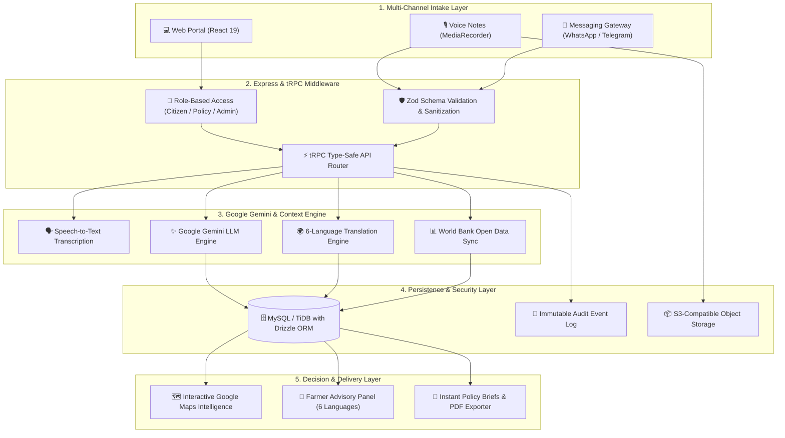
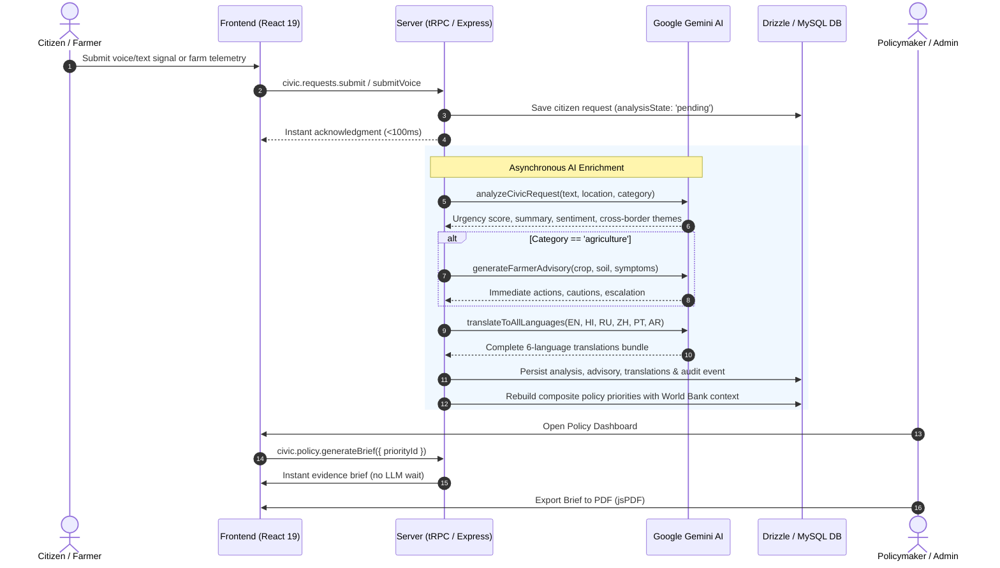

<div align="center">

# 🌐 CivicNexus BRICS
### AI-Powered Community Demand Intelligence & Policy Decision Infrastructure

[](https://hack2skill.com/event/codeforcommunities2)
[](https://ai.google.dev/)
[](https://www.typescriptlang.org/)
[](https://trpc.io/)
[](https://react.dev/)
[](https://tailwindcss.com/)
[](LICENSE)

<p align="center">
  <b>Bridging grassroots citizen signals, rural agricultural advisory, and cross-border public policy synthesis across BRICS nations using multimodal Google AI, live World Bank contextual intelligence, and automated evidence briefs.</b>
</p>

[Explore Live Map](#-core-capabilities) • [Architecture](#-system-architecture) • [Hackathon Tracks](#-hackathon-tracks-coverage) • [Quick Start](#-getting-started) • [API Reference](#-api-architecture)

---

</div>

## 📌 Executive Summary

Modern public infrastructure planning often suffers from severe information asymmetry: citizen grievances arrive fragmented across languages, rural farmers lack localized real-time agronomy advisories, and policymakers lack attributable evidence to prioritize capital investment.

**CivicNexus BRICS** solves this by establishing a unified, multilingual civic intelligence network operating across Brazil, Russia, India, China, and South Africa. It accepts voice, text, and messaging signals, enriches them through **Google Gemini**, cross-references real-time **World Bank** socioeconomic baselines, and generates actionable, human-auditable policy briefs and farmer advisories.

---

## 🎯 Hackathon Tracks Coverage

CivicNexus BRICS directly implements end-to-end functionality across all 4 hackathon tracks:

| Track | Problem Statement | CivicNexus BRICS Implementation | Key Code Components |
| :--- | :--- | :--- | :--- |
| **Track 1: Constituency Development Planning** | Prioritizing infrastructure investments based on localized community need and capital readiness. | Composite multi-factor priority scoring algorithm combining citizen urgency, cross-border theme clustering, and World Bank indicators. Instant evidence brief generation. | [`server/policy.ts`](server/policy.ts)<br>[`server/routers/civic.ts`](server/routers/civic.ts)<br>[`client/src/pages/PolicyDashboard.tsx`](client/src/pages/PolicyDashboard.tsx) |
| **Track 2: Pollution Hotspot & Environmental Risk** | Detecting environmental emergencies, unsafe water access, and urban climate vulnerabilities. | Geospatial clustering halo visualizer, cross-nation environmental risk categorization (`climate`, `water`, `sanitation`), and automated severity indexing. | [`client/src/components/RequestMap.tsx`](client/src/components/RequestMap.tsx)<br>[`server/ai.ts`](server/ai.ts)<br>[`drizzle/schema.ts`](drizzle/schema.ts) |
| **Track 3: Smart Health Centre Management** | Surfacing rural healthcare deficits, critical medical supply interruptions, and sanitation barriers. | Critical urgency triage (`low` -> `critical`), automated administrative dispatch alerting, and hospital/clinic accessibility attribution. | [`server/civicService.ts`](server/civicService.ts)<br>[`client/src/pages/RequestDetail.tsx`](client/src/pages/RequestDetail.tsx)<br>[`server/access.ts`](server/access.ts) |
| **Track 4: AI-Driven Farmer Advisory** | Providing smallholder farmers with immediate crop, pest, weather, and soil remediation advice. | Dedicated `/farmer` advisory module with structured farm telemetry ingestion (crop type, acreage, soil, irrigation), Google Gemini agronomy triage, multi-language translation, and safety guardrails. | [`client/src/pages/FarmerAdvisory.tsx`](client/src/pages/FarmerAdvisory.tsx)<br>[`server/ai.ts`](server/ai.ts)<br>[`server/farmerAdvisory.test.ts`](server/farmerAdvisory.test.ts) |

---

## 🏛️ System Architecture



---

## 🔄 End-to-End Request & Advisory Lifecycle



---

## 🌟 Core Capabilities

### 1. 🌾 AI-Driven Farmer Advisory & Rural Intelligence
- **Structured Agronomy Ingestion**: Captures crop type, acreage, soil condition, irrigation methods, and pest/disease symptoms.
- **Multilingual Delivery**: Gemini synthesizes actionable guidance and translates it into all 6 BRICS working languages (English, Hindi, Russian, Simplified Chinese, Portuguese, Arabic).
- **Safety Guardrails**: Strict non-chemical safety warnings, environmental cautions, and statutory extension service escalation paths.

### 2. 🗣️ Multilingual Voice & Messaging Gateway
- **Zero-Barrier Intake**: Supports browser voice recording with Whisper transcription, text submissions, and authenticated WhatsApp/Telegram webhooks.
- **Timing-Safe Authentication**: Authenticates external gateway requests using `crypto.timingSafeEqual` with idempotency deduplication.

### 3. 📊 Real-Time World Bank Contextual Benchmarking
- Synchronizes real socioeconomic and infrastructure indicators directly from the World Bank API:
  - `SH.H2O.SMDW.ZS`: Access to basic drinking water services
  - `EG.ELC.ACCS.ZS`: Access to electricity
  - `IT.NET.USER.ZS`: Individuals using the Internet
  - `AG.LND.AGRI.ZS`: Agricultural land (% of land area)
  - `NV.AGR.TOTL.ZS`: Agriculture value added (% of GDP)
  - `SP.POP.TOTL`: Total population baseline
- Calibrates priority scores using national infrastructure deficits to ensure fair resource allocation.

### 4. 📄 Instant Policy Briefs & Client-Side PDF Generation
- Assembles comprehensive, human-in-the-loop evidence briefs combining citizen voice, cross-border cluster themes, and attributable data sources.
- Exports instant, presentation-ready PDF briefs via `jspdf` without blocking on asynchronous AI refinement.

---

## 🛠️ Technology Stack

| Layer | Technologies |
| :--- | :--- |
| **Frontend** | React 19, Vite 7, Tailwind CSS v4, Radix UI primitives, Lucide Icons, Wouter Router, TanStack Query |
| **Backend** | Node.js, TypeScript 5.9, Express, tRPC v11, Zod schema validation |
| **AI & NLP** | Google Gemini (Gemini 2.5 Flash / Pro via dynamic model resolution), Whisper Speech-to-Text |
| **Database & ORM** | MySQL 2 / TiDB Serverless, Drizzle ORM, Drizzle Kit |
| **Geospatial & Viz** | Google Maps JavaScript API (Advanced Markers, Density Halos, Geocoding), Recharts |
| **Testing** | Vitest 2.1, Unit & Integration test suite |

---

## 🚀 Getting Started

### Prerequisites
- Node.js `>= 20.0.0`
- `pnpm` `>= 10.0.0`
- MySQL / TiDB database (or local MySQL instance)
- Google AI (Gemini) API Key

### Installation

```bash
# 1. Clone the repository
git clone https://github.com/Rishisharma029/CivicNexus-BRICS.git
cd CivicNexus-BRICS

# 2. Install dependencies
pnpm install

# 3. Configure environment variables
cp .env.example .env
# Edit .env and supply your DATABASE_URL, GEMINI_API_KEY, and JWT_SECRET

# 4. Push database schema migrations
pnpm run db:push

# 5. Start the development server
pnpm run dev
```

The application will be running at `http://localhost:3000`.

---

## 🧪 Testing & Verification

CivicNexus BRICS contains an extensive suite of unit and integration tests:

```bash
# Run all tests
pnpm test

# Run type check
pnpm run check
```

### Test Coverage Highlights:
- `farmerAdvisory.test.ts`: Farm telemetry schema validation, advisory guardrails, category formatting.
- `ai.test.ts`: Urgency boundaries (0–100), 6-language translation integrity, classification schemas.
- `briefLatency.test.ts`: Non-blocking instant policy brief generation without LLM latency.
- `voiceFlow.test.ts`: Voice transcript normalization and preview URL ownership verification.
- `access.test.ts`: Role-Based Access Control matrix for citizens, policymakers, and administrators.
- `nationalContext.test.ts`: Weighted World Bank indicator score calculation and evidence attribution.

---

## 🔒 Security & Privacy

- **Timing-Safe Webhooks**: Message ingestion endpoints are protected against timing attacks.
- **Strict Role Boundaries**: Policymakers cannot submit citizen signals; citizens cannot access moderation panels.
- **Audit Trails**: Complete transparency log tracking AI model versions, timestamps, and data changes.
- **Content Moderation**: AI guardrails ensure no unverified or unsafe agronomic advice is returned.

See [`SECURITY.md`](SECURITY.md) for full vulnerability reporting guidelines.

---

## 📄 License & Code of Conduct

- **License**: Distributed under the [MIT License](LICENSE).
- **Code of Conduct**: This project adheres to the [Contributor Covenant v2.1](CODE_OF_CONDUCT.md).

---

<div align="center">
  <sub>Built with ❤️ for <b>Google Build with AI: Code for Communities 2.0</b></sub>
</div>
